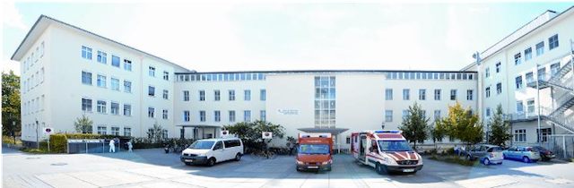

{: .center-image}

We are part of the Department of Neurology, University of Cologne and located at:
 
 
Gebäude 30 
Kerpener Str. 62 
50937 Köln 
 

Please don't hesitate to contact us if you have any questions regarding our research.
We are always looking for motivated students who want to perform their Bachelor's, Master's or MD (Dr. med.) thesis work with us.
 
 

#### Contact: lukas.volz@uk-koeln.de
