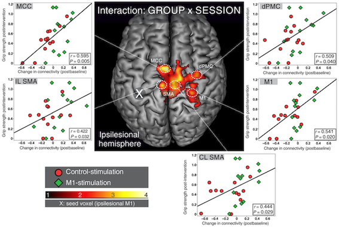

# Research
 

## Cerebral Reorganization after Stroke
{: .center-image}
The brain cannot regenerate neural tissue damaged by stroke. Improvement of functional impairment thus has to arise from repurposing intact neural circuitry to accommodate the neural processes necessary to compensate for the tissue loss. When patients are initial unable to move their hand (_hemiplegia_), different parts of the brain take over hand motor control to enable the patients to relearn to hand use. This process is referred to as _**cerebral reorganization**_. In our lab we study how the brain accomplishes successful reorganization using functional neuroimaging (fMRI, EEG) and non-invasive brain stimulation (TMS). Since functional reorganization mainly occurs in the first weeks after stroke – the so-called _critical-period_ – we focus on the longitudinal assessment of acute stroke patients in a hospitalized setting. Our goal lies in the development of translational approaches to (i) predict the recovery-potential of individual patients and (ii) modulate reorganization to amplify motor recovery.
 

#### publications:
1. **Volz LJ**, Grefkes C **(2013)** Neurophysiological and Neuroimaging Predictors of Functional Recovery after Stroke. _Klinische Neurophysiologie 44:238-246_
2. 	**Volz LJ**, Sarfeld AS, Diekhoff S, Rehme AK, Pool EM, Eickhoff SB, Fink GR, Grefkes C **(2015)** Motor Cortex Excitability and Connectivity in chronic stroke – A multimodal model of functional reorganization. _Brain Structure and Function 220(2):1093-107_
3. 	Rehme AK, **Volz LJ**, Feis DL, Bomilcar-Focke I, Liebig T, Eickhoff SB, Fink GR, Grefkes C **(2015)** Identifying neuroimaging markers of motor disability in acute stroke by machine learning techniques. _Cerebral Cortex 25(9):3046-56_
4. 	Rehme AK, **Volz LJ**, Feis DL, Eickhoff SB, Fink GR, Grefkes C **(2015)** Early neuroimaging predictors of chronic motor disability after stroke. _Human Brain Mapping 36(11):4553-65_
5.  **Volz LJ**, Rehme AK, Michely J, Nettekoven C, Eickhoff SB, Fink GR, Grefkes C **(2016)** Shaping Early Reorganization of Neural Networks Promotes Motor Function after Stroke. _Cerebral Cortex 26(6):2882-2894_
6. **Volz LJ**, Vollmer M, Michely J, Fink GR, Grefkes C, Rothwell JC, Grefkes C **(2017)** Time-dependent functional role of the contralesional motor cortex after stroke. _NeuroImage: Clinical: 16: 165-174_
 
 

## Brain Stimulation
Non-invasive brain stimulation such as transcranial magnetic stimulation (TMS) allows us to interact with the human brain in several ways. While single pulse TMS can be used to probe the excitability of motor system, repetitive TMS (rTMS) modulates neural activity of the stimulated circuitry beyond the duration of the stimulation. Finally, stimulation of cortical regions during task performance (_online TMS_) can help to investigate the functional role of cortical areas for the performed task in a causal way.
In our lab we investigate the mechanisms underlying plasticity-induction in the human brain and use _online TMS_ to further our mechanistic understanding of regional contributions to complex and distributed brain functions such as motor control. Specifically, we aim at furthering our mechanistic understanding of _cerebral reorganization_ and _reward-dependent motor learning_ after stroke and ask the question how we can utilize rTMS to modulate post-stroke plasticity to benefit functional recovery.
 

#### publications:
1. **Volz LJ**, Benali A, Mix A, Neubacher U, Funke K **(2013)** Dose-dependence of changes in cortical protein expression induced with repeated transcranial magnetic theta-burst stimulation in the rat. _Brain Stimulation 6(4):598-606_
2. Cárdenas-Morales L, **Volz LJ**, Rehme AK, Pool EM, Nettekoven C, Eickhoff SB, Fink GR, Grefkes C **(2014)** Network Connectivity and Individual Responses to Brain Stimulation in the Human Motor System. _Cerebral Cortex 24(7):1697-707 (shared first-authorship)_
3. Nettekoven C, **Volz LJ**, Kutscha M, Pool EM, Rehme AK, Eickhoff SB, Fink GR, Grefkes C **(2014)** Dose- dependent effects of theta-burst rTMS on cortical excitability and resting-state connectivity of the human motor system. _Journal of Neuroscience 34(20):6849-59_
4. Nettekoven C, **Volz LJ**, Leimbach M, Pool EM, Rehme AK, Eickhoff SB, Fink GR, Grefkes C **(2015)** Inter-individual variability in cortical excitability and motor network connectivity following multiple blocks of rTMS. _NeuroImage 118: 209–218_
5. **Volz LJ**, Hamada M, Rothwell JC, Grefkes C **(2015)** What makes the muscle twitch: motor system connectivity and TMS-induced activity. _Cerebral Cortex 25(9):2346-53_
6. Krall SC, **Volz LJ**, Oberwelland E, Grefkes C, Fink GR, Konrad K **(2016)** The right temporoparietal junction in attention and social interaction: A transcranial magnetic stimulation study. _Human Brain Mapping, 37(2), 796-807_
7. **Volz LJ**, Hamada M, Rothwell JC, Grefkes C **(under review)** What makes the muscle twitch more: a multimodal model of plasticity induction
 
 

## Brain Network Connectivity
Human behavior is typically not controlled by single brain regions but results from the fine-tuned interaction of multiple brain areas. Analyzing the connectivity of remote but inter-connected brain areas can help to understand the neural mechanisms underlying human behavior and its impairment due to diseases.
We use a multimodal approach of structural and functional MRI to further our insights into the functional anatomy of how the brain integrates information to enable the human condition. Specifically, we aim at integrating insights from a multimodal perspective to understand how network structure predetermines function with an emphasis on network alterations due to stroke lesions or degenerative processes.
 

#### publications:
1.	Cieslak M, Meiring W, Brennan T, Greene C, **Volz LJ**, Vettel JM, Suri S, Grafton ST **(2018)** Compositional measures of diffusion anisotropy and asymmetry. _Biomedical Imaging (ISBI 2018), IEEE 15th International Symposium: 123-126_
1.	**Volz LJ**, Cieslak M, Grafton ST (2018) Compartmentalizing white matter reduces profound variability of anisotropy measures. _Brain Structure and Function 223(2), 635-651_
1.	Cieslak M, Brennan T, Meiring W, **Volz LJ**, Asturias A, Surib S, Grafton ST **(2018)** Analytic tractography: A closed-form solution for estimating local white matter connectivity with diffusion MRI. _NeuroImage 169: 473–484_
1.	Michely J, **Volz LJ**, Hoffstaedter F, Eickhoff SB, Fink GR, Grefkes C **(2018)** Network connectivity of motor control in the ageing brain. _NeuroImage: Clinical 18: 443-455_
1.	**Volz LJ**, Eickhoff SB, Pool EM, Fink GR, Grefkes C **(2015)** Differential Modulation of Motor Network Connectivity during Movements of the Upper and Lower Limbs. _NeuroImage 119: 44–53_
1.	Michely J, **Volz LJ**, Barbe M, Hoffstaedter F, Viswanathan S, Timmermann L, Eickhoff SB, Fink GR, Grefkes C **(2015)** Dopaminergic modulation of motor network dynamics in Parkinson’s disease. _Brain 138(Pt 3):664-78_
 
 

## Decision-making and Learning
Decision-making has a profound influence on our daily life and personal development. Implementing new control-policies which allow to change our decision-making behavior and skill-acquisition through learning enable us to adapt to our ever changing environment. Understanding the neural basis of decision-making and learning thus is paramount not only from a theoretical perspective, but has many practical implications ranging from understanding human behavior in moral or social situations to how we compensate brain lesions by adapting motor control-policies and learning new motor skills to compensate functional impairment. In particular, the question how cerebral reorganization after stroke impacts on and interacts with decision-making and skill learning (e.g. in the motor domain) remains poorly understood. Our goal is to combine increasingly complex behavioral readouts reflecting motor learning and changes in decision-making patterns with multimodal neural data in stroke patients to elucidate how the heightened level of neural plasticity in the critical-period early after stroke is shaped by and allows motor-skill learning and formation of new decision-making policies. Specifically, we aim at increasing our mechanistic understanding of how changes in learning and decision-making facilitate functional recovery after brain lesions and developing novel treatment approaches by modulating such mechanisms, e.g. via suitable reinforcement strategies (reward/punishment), neuropharmacological interventions or non-invasive brain stimulation.
 

#### publications:
1.	**Volz LJ** et al. _(in preperation)_
1.	Layher E, Santander T, **Volz LJ**, Miller MB **(2018)** Failure to affect decision criteria during recognition memory with continuous theta burst stimulation. _Frontiers in Neuroscience 12: 705_
1.	**Volz LJ**, Welborn LB, Gobel MS, Gazzaniga MS, Grafton ST **(2017)** Harm to self outweighs benefit to others in moral decision making. _Proceedings of the Nation Academy of Sciences 114 (30): 7963-7968_
 
 

## Split-brain and Consciousness
The insights gained from testing these so called ‘split-brain’ patients, which underwent sectioning of the corpus callosum as a treatment for severe epilepsy, have profoundly shaped the field of cognitive neuroscience and helped to establish seminal information processing models for how the brain governs behavior and cognition. For example, split-brain research has highlighted distinct interpretive capacities of both cerebral hemispheres and contributed important pieces to the puzzle of deciphering the neurobiological foundations that give rise to our conscious experience of the world.
 

#### publications:
1.	**Volz LJ**, Hillyard SA, Miller MB, Gazzaniga MS **(2018)** Unifying control over the body: consciousness and cross- cueing in split-brain patients. _Brain 141 (3), e15_
1.	**Volz LJ**, Gazzaniga MS **(2017)** Interaction in isolation - 50 years of insights from split-brain research. _Brain 140 (7): 2051-2060_
 
 

## Translational Neuroimaging
Advanced functional and structural neuroimaging methods such as diffusion MRI or fMRI offer the potential to further our mechanistic understanding of psychiatric and neurological disease and may help to create new diagnostic tools enabling earlier and more accurate diagnosis and even prognosis on the level of individual patients. Our goal is to advance the clinical utility of neuroimaging by applying novel methods to patient populations in cooperation with both methodological experts and specialized clinicians.
 

#### publications:
1.	Cohrs G, Huhndorf M, Niemczyk N, **Volz LJ**, Bernsmeier A, Singhal A, Larsen N, Synowitz M, Knerlich- Lukoschus F **(2018)** MRI in mild pediatric traumatic brain injury: diagnostic overkill or useful tool? _Child's nervous system 34 (7), 1345-1352_
1.	**Volz LJ**, Kocher M, Lohmann P, Shah NJ, Fink GR, Galldiks N **(2018)** Functional magnetic resonance imaging in glioma patients: from clinical applications to future perspectives. _The quarterly journal of nuclear medicine and molecular imaging 62(3):295-302_
1.	Pedrosa DJ, Nelles C, Brown P, **Volz LJ**, Pelzer EA, Tittgemeyer M, Brittain JS, Timmermann L **(2017)** The differentiated networks related to Essential tremor onset and its amplitude modulation after alcohol intake. _Experimental Neurology 297: 50–61_
