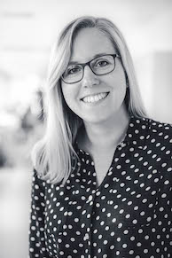

# People
{: .align-left}

Lukas J. Volz, MD 
Group Leader 
publications: [google scholar](https://scholar.google.com/citations?user=jD4Faz4AAAAJ&hl=en&oi=ao) 
[CV](/img/CV_Lukas_J_Volz_2019.pdf)
 
 

{: .align-left}

Theresa Paul, BSc 
PhD Candidate 
 
 

### Collaborations
We continuously collaborate with following international experts:

- Prof. Michael S. Gazzaniga, University of California, Santa Barbara, USA
- Prof. Scott T. Grafton, University of California, Santa Barbara, USA
- Prof. John C. Rothwell, University of London, UK
- Prof. Masashi Hamada, University of Tokyo, Japan
- Prof. Simon B. Eickhoff, Düsseldorf University, Germany
- Prof. Christian Grefkes, University of Cologne, Germany
- Prof. Gereon R. Fink, University of Cologne, Germany
